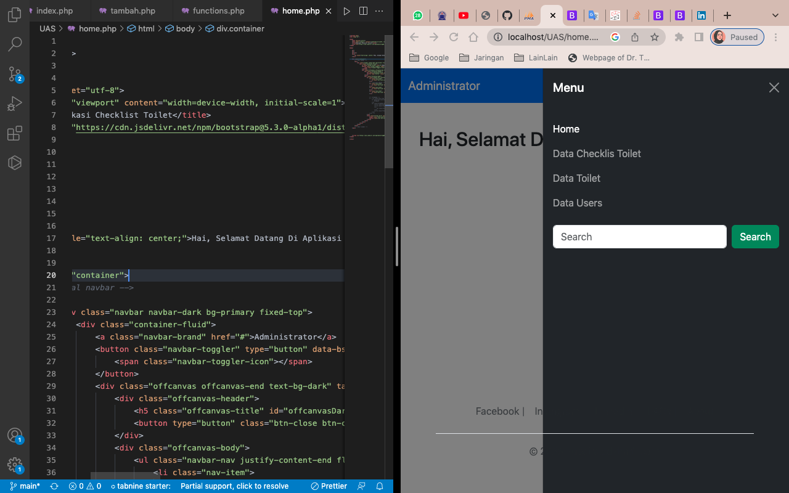

# Lab_UAS

Tugas UAS

Nama : Zubair Al Adzhari.
NIM : 312110256.
Kelas : TI21B1.
Matkul : Pemrograman Web.

# Hasil Scrensoot Aplikasi checklist Toilet

# DATABASE

## Tampilan home database

## Tampilan data checklis database

## Tampilan data toilet

## Tampilan data users

# CODINGAN

## Tampilan Home

## Tampilan code dan hasil data checklist

### data checklist

### tambah checklis

### hapus checklist

## Tampilan code dan hasil data Toilet

### data Toilet

### Tambah Toilet

### Hapus Toilet

### ubah Toilet

## Tampilan code dan hasil data users

### data users

### tambah users

### Hapus Users

## SEKIAN DAN TERIMAKASIH
